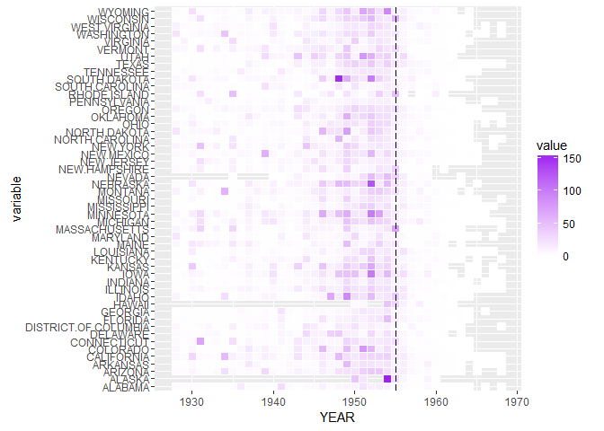

1928-1969?????獄??蝢??????????
================

鞈?????
===========

?????€?€脖??

``` r
polio<-read.csv("POLIO_Incidence.csv",stringsAsFactors = F)
head(polio)
```

    ##   YEAR WEEK ALABAMA ALASKA ARIZONA ARKANSAS CALIFORNIA COLORADO
    ## 1 1928    1       0      -       0        0       0.17     0.39
    ## 2 1928    2       0      -       0        0       0.15      0.2
    ## 3 1928    3    0.04      -       0        0       0.11        0
    ## 4 1928    4       0      -    0.24     0.11       0.07      0.2
    ## 5 1928    5       0      -    0.24        0       0.32        0
    ## 6 1928    6       0      -       0        0       0.22      0.1
    ##   CONNECTICUT DELAWARE DISTRICT.OF.COLUMBIA FLORIDA GEORGIA HAWAII IDAHO
    ## 1           0        0                    -       0    0.03      -     0
    ## 2           0        0                    -       0       0      -     0
    ## 3        0.06        0                    -       0       -      -     0
    ## 4        0.06        0                    0       0       0      -     0
    ## 5        0.13        0                    0       0       0      -     0
    ## 6           0        0                    0       0       0      -     -
    ##   ILLINOIS INDIANA IOWA KANSAS KENTUCKY LOUISIANA MAINE MARYLAND
    ## 1     0.03    0.03 0.08      0        0         0     0     0.06
    ## 2     0.01    0.03    -   0.22        0      0.05  0.13     0.06
    ## 3     0.03    0.03    -      0        0         0     0        0
    ## 4     0.05    0.12    0      0        0         0     0        0
    ## 5     0.04       0 0.04      0        0         0  0.38     0.12
    ## 6     0.03       0    0      0        0         0     0        0
    ##   MASSACHUSETTS MICHIGAN MINNESOTA MISSISSIPPI MISSOURI MONTANA NEBRASKA
    ## 1          0.14     0.04         0           0     0.03    0.18     0.07
    ## 2          0.14     0.04      0.04           0     0.06       0     0.07
    ## 3          0.07     0.02         0           0     0.03    0.18        0
    ## 4          0.02     0.02         0           0     0.06       0        0
    ## 5          0.02     0.04         0           0        0       0     0.15
    ## 6          0.05     0.06         0           0        0       0     0.07
    ##   NEVADA NEW.HAMPSHIRE NEW.JERSEY NEW.MEXICO NEW.YORK NORTH.CAROLINA
    ## 1      -             -       0.08          0     0.08              0
    ## 2      -             -       0.03          0     0.05           0.03
    ## 3      -             -          0          0     0.03              0
    ## 4      -             0       0.03          0     0.06              0
    ## 5      -             0       0.03       0.48     0.07              0
    ## 6      -             0          0          0     0.03              0
    ##   NORTH.DAKOTA OHIO OKLAHOMA OREGON PENNSYLVANIA RHODE.ISLAND
    ## 1            - 0.02        0   0.64            0            0
    ## 2         0.45    -     0.04   0.43         0.03            0
    ## 3            0 0.06        0   1.07         0.02            0
    ## 4         0.15    0     0.09   0.53         0.02            0
    ## 5            0 0.03        0   0.32            0            0
    ## 6            0 0.05     0.04   0.21         0.04            0
    ##   SOUTH.CAROLINA SOUTH.DAKOTA TENNESSEE TEXAS UTAH VERMONT VIRGINIA
    ## 1           0.06            0      0.04  0.05    0       0        -
    ## 2           0.06            0      0.04  0.04    0       0        -
    ## 3           0.35            0         0     0    0       0        -
    ## 4           0.23            0      0.04  0.05    0       0        -
    ## 5           0.17         0.15         0  0.05    0       0        -
    ## 6           0.06         0.29      0.04     0  0.2       0     0.04
    ##   WASHINGTON WEST.VIRGINIA WISCONSIN WYOMING
    ## 1       0.26          0.06      0.03       0
    ## 2       0.39          0.24      0.03       0
    ## 3       0.13          0.12      0.03       0
    ## 4       0.06          0.12         0       0
    ## 5       0.13          0.06      0.03       0
    ## 6       0.06             0      0.14       0

撠祝銵冽頧?銵冽

``` r
#install.packages("reshape")
library(reshape)
```

    ## Warning: package 'reshape' was built under R version 3.2.5

``` r
polio.m<-melt(polio,id.vars = c('YEAR','WEEK'))
head(polio.m)
```

    ##   YEAR WEEK variable value
    ## 1 1928    1  ALABAMA     0
    ## 2 1928    2  ALABAMA     0
    ## 3 1928    3  ALABAMA  0.04
    ## 4 1928    4  ALABAMA     0
    ## 5 1928    5  ALABAMA     0
    ## 6 1928    6  ALABAMA     0

???撩?€?

``` r
polio.m[polio.m$value=="-",]$value<-NA #???撩?€?,撠?"-"頧NA
polio.m$value<-as.numeric(as.character(polio.m$value)) #撠alue甈???摮?
```

閮?僑摨衣????

``` r
polio.sumYear<- #????僑摨血?蜇嚗??府撟游漲??蜇?????
    aggregate(value~YEAR+variable,data=polio.m,FUN=sum,na.rm=F)
head(polio.sumYear)
```

    ##   YEAR variable value
    ## 1 1928  ALABAMA  2.39
    ## 2 1929  ALABAMA  2.25
    ## 3 1930  ALABAMA  2.57
    ## 4 1931  ALABAMA  2.07
    ## 5 1932  ALABAMA  1.38
    ## 6 1933  ALABAMA  1.12

閬死???
===========

閫??????耦蝔桅?????eatmap????隞隞亦隞出Y頠貉??憿摰??銝€雁摨?(撟港遢?€??€????)????葉敶潭迨???????€?

蝔?Ⅳ嚗?誑撟港遢雿X頠貊????€頠訾?蝢???€??散???迂嚗?€??靘＊蝷箔??僑隞賢?????獄????????蜇嚗蒂撠??獄??????誑???蝝怨?撠憭折＊蝷箏瘥?€?€?銝哨?蒂銝1955撟港葉??Y頠貊???€?

??耦??嚗?

``` r
#install.packages("ggplot2")
library(ggplot2)
```

    ## Warning: package 'ggplot2' was built under R version 3.2.5

``` r
ggplot(polio.sumYear, aes(YEAR, variable)) + #aes(x,y)
    geom_tile(aes(fill = value),colour = "white")+
  geom_vline(xintercept = 1955,colour="black", linetype = "longdash")+ #geom_tile: ??€憛?
    scale_fill_gradient(low = "white",high = "purple") #??€潔???
```

<!-- -->

??耦閫????Heatmap???耦銝剔1928?1969撟湧???獄??????????誑撟港遢雿X頠貊????€頠訾?蝢???€??散???迂嚗?€??靘＊蝷箔??僑隞賢?????獄????????蜇嚗蒂撠??獄??????誑???蝝怨?撠憭折＊蝷箏瘥?€?€?銝哨???1930撟游???獄?????€撓銝??1950撟游椰??????陸嚗€?1955撟港葉??Y頠貊????甇文??1955撟游??(撠?獄?????)蝝怨??霈?”蝷箏??獄颲衣?????＊撽??隅?嚗?????????????獄???????
