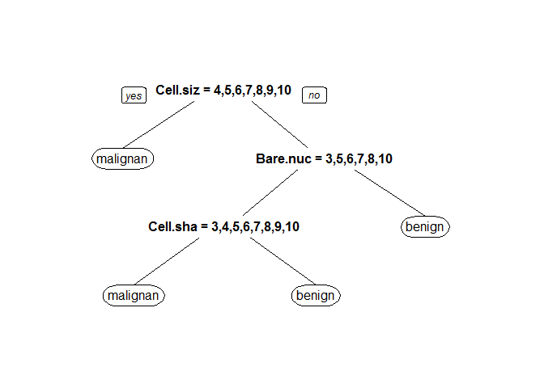

乳癌預測模型
================

資料前處理
----------

### 資料解釋

此資料來源為UCI Machine Learning Repository。

資料內共紀錄699個病人資料，用來預測病人的乳房腫瘤是良性還是陰性，裡頭包含了11個參數，例如細胞大小等等...。分類結果為二元分類，包刮陰性(malignant)與良性(benign)。

### 資料讀取

``` r
#install.packages("mlbench")
library(mlbench)
```

    ## Warning: package 'mlbench' was built under R version 3.2.5

``` r
data(BreastCancer)
str(BreastCancer)
```

    ## 'data.frame':    699 obs. of  11 variables:
    ##  $ Id             : chr  "1000025" "1002945" "1015425" "1016277" ...
    ##  $ Cl.thickness   : Ord.factor w/ 10 levels "1"<"2"<"3"<"4"<..: 5 5 3 6 4 8 1 2 2 4 ...
    ##  $ Cell.size      : Ord.factor w/ 10 levels "1"<"2"<"3"<"4"<..: 1 4 1 8 1 10 1 1 1 2 ...
    ##  $ Cell.shape     : Ord.factor w/ 10 levels "1"<"2"<"3"<"4"<..: 1 4 1 8 1 10 1 2 1 1 ...
    ##  $ Marg.adhesion  : Ord.factor w/ 10 levels "1"<"2"<"3"<"4"<..: 1 5 1 1 3 8 1 1 1 1 ...
    ##  $ Epith.c.size   : Ord.factor w/ 10 levels "1"<"2"<"3"<"4"<..: 2 7 2 3 2 7 2 2 2 2 ...
    ##  $ Bare.nuclei    : Factor w/ 10 levels "1","2","3","4",..: 1 10 2 4 1 10 10 1 1 1 ...
    ##  $ Bl.cromatin    : Factor w/ 10 levels "1","2","3","4",..: 3 3 3 3 3 9 3 3 1 2 ...
    ##  $ Normal.nucleoli: Factor w/ 10 levels "1","2","3","4",..: 1 2 1 7 1 7 1 1 1 1 ...
    ##  $ Mitoses        : Factor w/ 9 levels "1","2","3","4",..: 1 1 1 1 1 1 1 1 5 1 ...
    ##  $ Class          : Factor w/ 2 levels "benign","malignant": 1 1 1 1 1 2 1 1 1 1 ...

### 資料前處理

留下沒有缺值的資料，並把無關病情的資料拿掉(ID)

``` r
BreastCancerC<-BreastCancer[complete.cases(BreastCancer),
!names(BreastCancer) %in% c("Id")] 
c(nrow(BreastCancer),nrow(BreastCancerC))
```

    ## [1] 699 683

### 將資料隨機分為訓練組與測試組

隨機將2/3的資料分到訓練組（Test==F），剩下1/3為測試組（Test==T)

``` r
#install.packages("rpart")
library(rpart)
```

    ## Warning: package 'rpart' was built under R version 3.2.5

``` r
BreastCancerC$Test<-F 
BreastCancerC[
    sample(1:nrow(BreastCancerC),nrow(BreastCancerC)/3),
    ]$Test<-T 

c(sum(BreastCancerC$Test==F),sum(BreastCancerC$Test==T)) 
```

    ## [1] 456 227

可得訓練組案例數為456測試組案例數為227

預測模型建立
------------

### 模型建立

由於變數多，且多為連續變項，而輸出為二元類別變項，故選擇決策樹演算法來建立模型。

``` r
#install.packages("rpart")
library(rpart)

BreastCancerC$Class<-factor(BreastCancerC$Class,levels=c("malignant","benign"))

#set.seed(1000)          
fit<-rpart(Class~.,data=BreastCancerC[BreastCancerC$Test==F,]) 

#install.packages("rpart.plot")
library(rpart.plot)
```

    ## Warning: package 'rpart.plot' was built under R version 3.2.5

``` r
prp(fit)
```

<!-- -->

``` r
summary(fit)
```

    ## Call:
    ## rpart(formula = Class ~ ., data = BreastCancerC[BreastCancerC$Test == 
    ##     F, ])
    ##   n= 456 
    ## 
    ##           CP nsplit rel error    xerror       xstd
    ## 1 0.78527607      0 1.0000000 1.0000000 0.06278524
    ## 2 0.06134969      1 0.2147239 0.2699387 0.03868164
    ## 3 0.04907975      2 0.1533742 0.2392638 0.03663788
    ## 4 0.01000000      3 0.1042945 0.1472393 0.02925348
    ## 
    ## Variable importance
    ##       Cell.size      Cell.shape     Bare.nuclei     Bl.cromatin 
    ##              21              17              16              15 
    ##    Epith.c.size   Marg.adhesion Normal.nucleoli    Cl.thickness 
    ##              14              14               2               1 
    ##         Mitoses 
    ##               1 
    ## 
    ## Node number 1: 456 observations,    complexity param=0.7852761
    ##   predicted class=benign     expected loss=0.3574561  P(node) =1
    ##     class counts:   163   293
    ##    probabilities: 0.357 0.643 
    ##   left son=2 (142 obs) right son=3 (314 obs)
    ##   Primary splits:
    ##       Cell.size    splits as  RRRLLLLLLL, improve=145.1531, (0 missing)
    ##       Bare.nuclei  splits as  RRLLLLLLLL, improve=143.0007, (0 missing)
    ##       Cell.shape   splits as  RRRLLLLLLL, improve=139.8334, (0 missing)
    ##       Bl.cromatin  splits as  RRRLLLLLLL, improve=131.5790, (0 missing)
    ##       Epith.c.size splits as  RRLLLLLLLL, improve=126.3997, (0 missing)
    ##   Surrogate splits:
    ##       Cell.shape    splits as  RRRLLLLLLL, agree=0.932, adj=0.782, (0 split)
    ##       Epith.c.size  splits as  RRRLLLLLLL, agree=0.899, adj=0.676, (0 split)
    ##       Bl.cromatin   splits as  RRRLLLLLLL, agree=0.890, adj=0.648, (0 split)
    ##       Marg.adhesion splits as  RRRLLLLLLL, agree=0.882, adj=0.620, (0 split)
    ##       Bare.nuclei   splits as  RRRLLLRLLL, agree=0.882, adj=0.620, (0 split)
    ## 
    ## Node number 2: 142 observations
    ##   predicted class=malignant  expected loss=0.04929577  P(node) =0.3114035
    ##     class counts:   135     7
    ##    probabilities: 0.951 0.049 
    ## 
    ## Node number 3: 314 observations,    complexity param=0.06134969
    ##   predicted class=benign     expected loss=0.08917197  P(node) =0.6885965
    ##     class counts:    28   286
    ##    probabilities: 0.089 0.911 
    ##   left son=6 (40 obs) right son=7 (274 obs)
    ##   Primary splits:
    ##       Bare.nuclei     splits as  RRLRLLLL-L, improve=26.32206, (0 missing)
    ##       Bl.cromatin     splits as  RRRLLRLL--, improve=19.70323, (0 missing)
    ##       Normal.nucleoli splits as  RRLLLLLRLL, improve=18.86913, (0 missing)
    ##       Cl.thickness    splits as  RRRRRRLLLL, improve=17.64144, (0 missing)
    ##       Cell.shape      splits as  RRRLLLLLLL, improve=15.01092, (0 missing)
    ##   Surrogate splits:
    ##       Marg.adhesion   splits as  RRRLLLLLLL, agree=0.911, adj=0.300, (0 split)
    ##       Normal.nucleoli splits as  RRRLLLLRRL, agree=0.911, adj=0.300, (0 split)
    ##       Bl.cromatin     splits as  RRRLLRLL--, agree=0.908, adj=0.275, (0 split)
    ##       Cl.thickness    splits as  RRRRRRRRLL, agree=0.898, adj=0.200, (0 split)
    ##       Mitoses         splits as  RRLR--LR-,  agree=0.895, adj=0.175, (0 split)
    ## 
    ## Node number 6: 40 observations,    complexity param=0.04907975
    ##   predicted class=malignant  expected loss=0.375  P(node) =0.0877193
    ##     class counts:    25    15
    ##    probabilities: 0.625 0.375 
    ##   left son=12 (22 obs) right son=13 (18 obs)
    ##   Primary splits:
    ##       Cell.shape      splits as  RRLLLLLLLL, improve=7.891414, (0 missing)
    ##       Cl.thickness    splits as  RRRRLLLLLL, improve=6.473785, (0 missing)
    ##       Cell.size       splits as  RLLLLLLLLL, improve=6.163333, (0 missing)
    ##       Normal.nucleoli splits as  RLLLRLR-LL, improve=6.057692, (0 missing)
    ##       Bl.cromatin     splits as  RRRLL-LL--, improve=5.266291, (0 missing)
    ##   Surrogate splits:
    ##       Cell.size       splits as  RLLLLLLLLL, agree=0.875, adj=0.722, (0 split)
    ##       Bl.cromatin     splits as  RRLLL-LR--, agree=0.800, adj=0.556, (0 split)
    ##       Normal.nucleoli splits as  RLLLLLL-LL, agree=0.800, adj=0.556, (0 split)
    ##       Cl.thickness    splits as  RRRRLLLLLL, agree=0.775, adj=0.500, (0 split)
    ##       Epith.c.size    splits as  RRLLLLLLLL, agree=0.775, adj=0.500, (0 split)
    ## 
    ## Node number 7: 274 observations
    ##   predicted class=benign     expected loss=0.01094891  P(node) =0.6008772
    ##     class counts:     3   271
    ##    probabilities: 0.011 0.989 
    ## 
    ## Node number 12: 22 observations
    ##   predicted class=malignant  expected loss=0.09090909  P(node) =0.04824561
    ##     class counts:    20     2
    ##    probabilities: 0.909 0.091 
    ## 
    ## Node number 13: 18 observations
    ##   predicted class=benign     expected loss=0.2777778  P(node) =0.03947368
    ##     class counts:     5    13
    ##    probabilities: 0.278 0.722

### 模型說明

由上述參數可知，以決策樹建立模型預測乳房腫瘤是否為陰性或良性，經最佳化後，所用到的參數為上圖的決策樹所示

預測模型驗證
------------

``` r
#install.packages("caret")
library(caret)
```

    ## Warning: package 'caret' was built under R version 3.2.5

    ## Loading required package: lattice

    ## Loading required package: ggplot2

    ## Warning: package 'ggplot2' was built under R version 3.2.5

``` r
MinePred<-predict(fit,newdata = BreastCancerC[BreastCancerC$Test==T,],type = "class")

sensitivity(MinePred,BreastCancerC[BreastCancerC$Test==T,]$Class)
```

    ## [1] 0.9493671

``` r
specificity(MinePred,BreastCancerC[BreastCancerC$Test==T,]$Class)
```

    ## [1] 0.972973

``` r
posPredValue(MinePred,BreastCancerC[BreastCancerC$Test==T,]$Class)
```

    ## [1] 0.9493671

``` r
negPredValue(MinePred,BreastCancerC[BreastCancerC$Test==T,]$Class)
```

    ## [1] 0.972973

使用病患資料來預測乳房腫瘤是否為陰性或良性，以決策樹模型預測是否為陰性，可得：

-   敏感度 94.9367089%
-   特異性 97.2972973%
-   陽性預測率 94.9367089%
-   陰性預測率 97.2972973%
